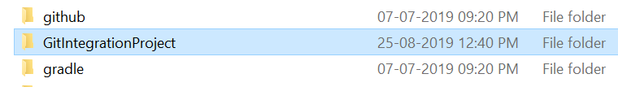
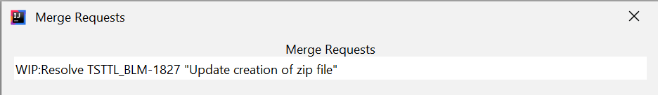
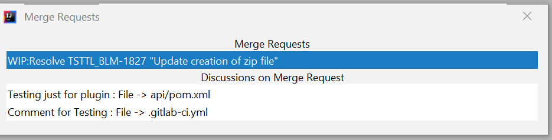
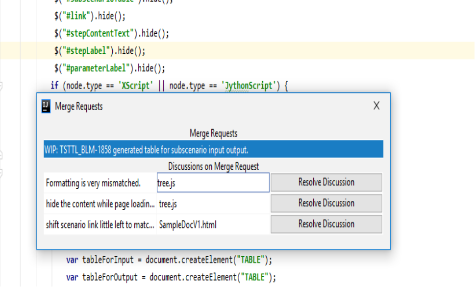

# GitIntegrationProject for IntelliJ IDEA
This project contains content using which you can connect to GIT API and you can access discussions done on any merge request.

##Introduction
This project is meant to ease the process with which the developers can directly access the discussions done on any 
merge request of any branch on their project by the reviewers.

The phase 1 development includes the showcase of discussions done on any part of code only along with the file name.

When you click on the discussion, you will automatically be taken up to the page where it was given.

Second, as of now, you will have to manually resolve the comment into GIT and once, that is done, you will no more 
see the discussions in the list.

## How to use
Just unzip the provided zip file from the repository in to the following path:

```properties
C:\Program Files\JetBrains\IntelliJ IDEA Community Edition 2019.1.3\plugins\
```

It will look something like this: 

To connect to your GIT hub server, the plugin will automatically read your projects GIT files.
But for the access token, you need to put a token in your Windows env variables as :

```properties
ENV_GIT_TOKEN=<YOUR GIT TOKEN>
```

Restart your IntelliJ IDEA and use the following shortcut to access this plugin:

```java
CTRL + ALT + SHIFT + M
```

You will see something like this :



When you click on the first element, i.e. the merge request, you will find out the discussions done on that merge request.



Further when you click on the discussion, you will be navigated to the specific file and the line on which the comment is given.



Once, you have done your review comments work, you can now go to GIT server and mark those comments as resolved.
After this, the comments will not be visible on this plugin UI.

The second phase of this plugin would include:

1. Option to mark the comments resolved directly from the plugin itself.
2. Option to add a comment for review on a file for a merge request directly from plugin itself.

