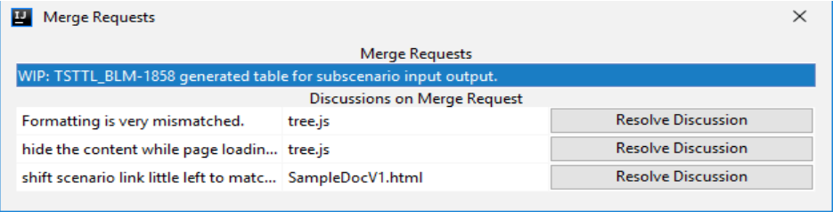

# GitIntegrationProject for IntelliJ IDEA
This project contains content using which you can connect to GIT API and you can access discussions done on any merge request.

## Introduction
This project is meant to ease the process with which the developers can directly access the discussions done on any 
merge request of any branch on their project by the reviewers.

The plugin includes to showcase of discussions done on any part of code only along with the file name and an option to resolve the discussion.

When you click on the discussion, you will automatically be taken up to the page where it was given.

## How to use
Just unzip the provided zip file from the repository releases in to the following path:
```text 
https://github.com/Inculator/GitIntegrationProject/releases/tag/1.x
```
```properties
C:\Program Files\JetBrains\IntelliJ IDEA Community Edition 2019.1.3\plugins\
```

It will look something like this: 

To connect to your GIT hub server, the plugin will automatically read your projects GIT files.
But for the access token, you need to put a token in your Windows env variables as :

```properties
ENV_GIT_TOKEN=<YOUR GIT TOKEN>
```

Restart your IntelliJ IDEA and use the following shortcut to access this plugin:

```java
CTRL + ALT + SHIFT + M
```

You will see something like this :


When you click on the first element, i.e. the merge request, you will find out the discussions done on that merge request.



If there is no discussion done on the merge request, you will get a good nice message.

Further when you click on the discussion in the middle row, which contains the file on which review is done, you will be navigated to the specific file and the line on which the comment is given.

You can read the comment from the first column of the table and you can then fix it in your code.
A yellow line hover on the file will appear as shown in the screenshot.


Once, you have done your review comments work, you can resolve the discussions as described in the Resolve section below.
After this, the comments will not be visible on this plugin UI.

### Resolve Discussion

Now, you can resolve the discussions directly from the plugin itself. Once, you have fixed your issues, you can go to the plugin and 
mark your discussion as resolve. It will resolve your discussion on GIT directly.

Next time you will open the plugin to load discussion, you will no longer see the issue that you have resolved.


Upcoming changes of this plugin would include:

1. Option to add a comment for review on a file for a merge request directly from plugin itself.

